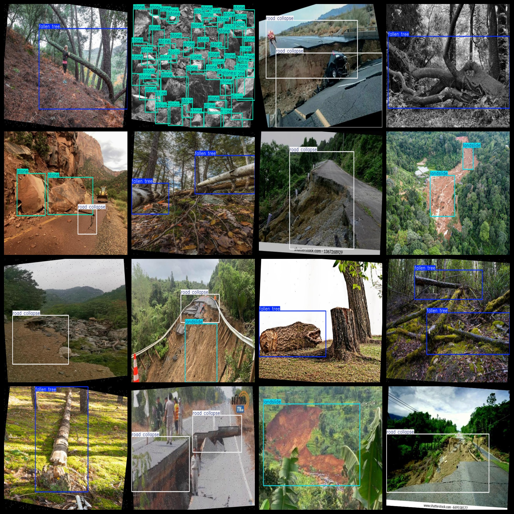
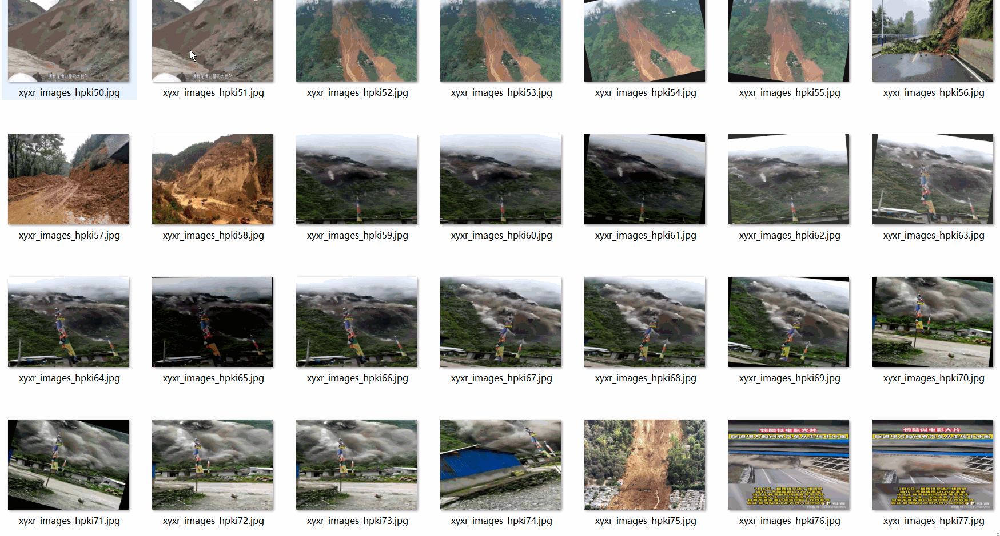

# Tree Fall down Landslide Road Cave Stones Detection Dataset 16813 images

Tree collapse landslide road collapse stone detection dataset 16813 sheets

Dataset format: Pascal VOC format + YOLO format (the txt file does not contain the split path, it only contains jpg images and corresponding VOC format xml files and yolo format txt files)

Number of images (jpg file count): 16813

Number of XML files: 16813

Number of txt files: 16813

Number of annotated categories: 4

The Github repository is: datasets_sl

["fallen tree", "landslide", "road collapse", "stone"]

Downed tree," landslide, "road collapse," stone.

Number of boxes labeled in each category:

Fallen tree frame count = 9477

Landslide Frames = 4821

Road collapse frames = 5613

Stone frame count = 21760

Total Frames: 41671

Number of images per category:

Fallen tree occupies 7530 pictures.

Landslides occupy 4432 pictures.

Road collapse has 3963 pictures.

Stone occupies a picture count = 2643

Image resolution: 640x480

Use the labeling tool: labelImg

Dataset Augmentation: Yes

Rules for annotation: Draw a rectangle around the category.

Important note: The dataset does not have been divided into training, validation, and testing sets.

Special Disclaimer: This dataset does not guarantee the accuracy of the trained models or weight files.

Annotation and image details are as follows:

## Images

---

Here is a pay link on Stripe (https://buy.stripe.com/3cs8yP7sY87d0vu9AB). Please contact me lonlonago@foxmail.com after funding $89, and I will send you a complete data files, thank you!

